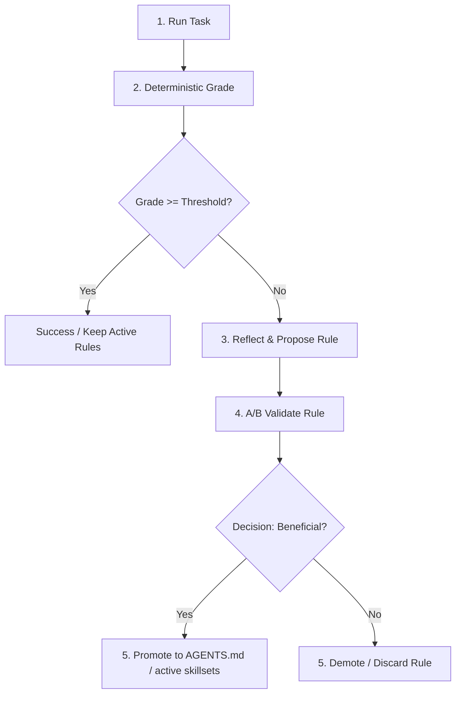
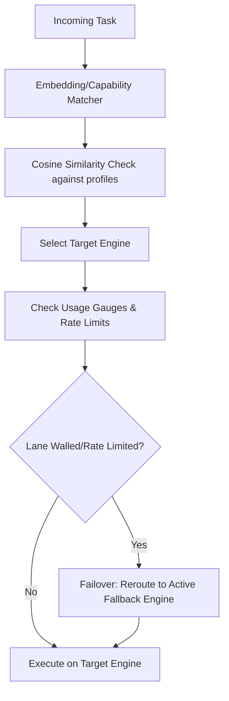
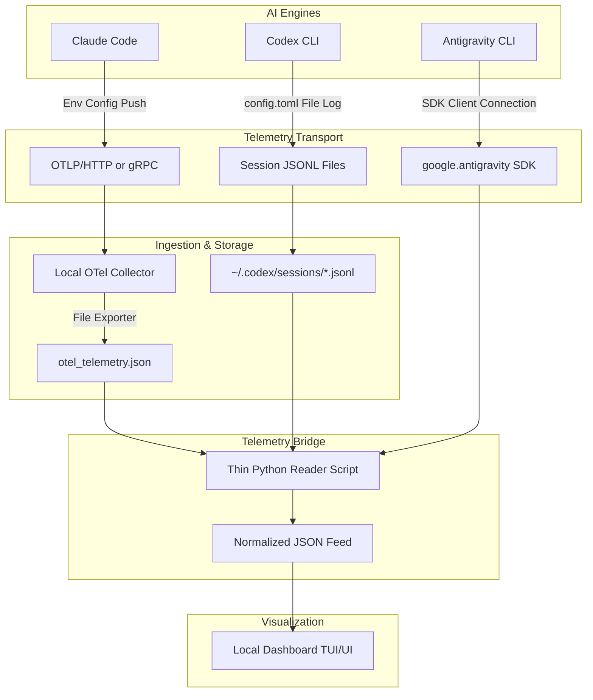

# Multi-Engine Agent Orchestration Upgrades (MMOI)

Welcome to the GitHub Wiki page for the latest system upgrades and architectural enhancements integrated into the multi-engine agent orchestration framework. These updates optimize cognitive performance, cost-efficiency, load resilience, and telemetric visibility across all active engines.

---

## 1. Engine-Scoped PTME Model Selection

To prevent "one-size-fits-all" model inefficiencies, the runtime now supports **Engine-Scoped PTME (Pre-Trained Model Engine) Selection**. This feature restricts and optimizes model choices based on the target engine family.

### How it Works
- **Model Family Isolation**: Each orchestration engine operates strictly within its native model family. Claude engines run Anthropic models, Codex engines run OpenAI models, and the localized `agy` engine runs Google models.
- **Contextual Tuning**: Instead of using a single default model for all tasks, the framework matches incoming tasks to the most suitable engine scope:
  - **Claude family** (e.g., `claude-3-5-sonnet`) is allocated to complex reasoning, research, and deep debugging.
  - **Codex family** (e.g., `gpt-4o`) is allocated to rapid code generation, translations, and boilerplate generation.
  - **Localized `agy` models** are allocated to low-latency checking, styling tasks, and lint-fixing.
- **Fallback Configuration**: Developers can define tiered fallback chains within the same engine scope. If a premium model is rate-walled or fails, the runtime cascades to a secondary model within the same engine family.

### How to Use
Engine-scoped PTME is configured via the central orchestration configuration file. Define the primary and fallback models per engine:
```json
{
  "engines": {
    "claude": {
      "primary_model": "claude-3-5-sonnet-latest",
      "fallback_model": "claude-3-5-haiku"
    },
    "codex": {
      "primary_model": "gpt-4o",
      "fallback_model": "gpt-4o-mini"
    },
    "agy": {
      "primary_model": "gemini-1.5-pro",
      "fallback_model": "gemini-1.5-flash"
    }
  }
}
```

---

## 2. Named Specialist Agents per Role

Rather than operating with generic, monolithic agent definitions, the platform enforces **Named Specialist Agents** with custom roles.

### How it Works
- **Dedicated Personas**: Agents are initialized with specific system instructions, restricted tool access levels, and execution guidelines. Examples of active specialists include:
  - `Codebase Researcher`: Equipped with code-search and file-viewing capabilities.
  - `Database Debugger`: Dedicated to schema verification and SQL validation.
  - `Interface Architect`: Specialized in UI design and asset generation.
- **Delegation Hierarchy**: Specialist agents can spawn subagents to delegate subtasks, keeping their own execution contexts clean and efficient.

### How to Use
Define a specialist in your project definition or call them dynamically using the orchestration API:
```python
from orchestration_framework import AgentRegistry

# Spawning a named specialist
researcher = AgentRegistry.get_agent(
    role="Codebase Researcher",
    task="Scan workspace for deprecated endpoints"
)
result = researcher.execute()
```

---

## 3. Real Per-Task Usage Capture

Accurate cost tracking and token auditing are critical for production deployments. The **Real Per-Task Usage Capture** system tracks token consumption and execution costs at the individual task level.

### Key Metrics Tracked
- **Input Tokens**: Raw prompt tokens sent to the engine (planned vs. actual).
- **Output Tokens**: Response tokens generated by the model.
- **Cache Read/Write Tokens**: Tracks usage of prompt-caching mechanisms (e.g., Anthropic's prompt caching) to calculate precise discounts.
- **Execution Cost**: Automatically calculated based on live model pricing tables.
- **Timestamps**: Logged per task execution for precise performance and latency profiling.

### How to Use
Usage capture is enabled by default. Task completion payloads now include a `usage` metadata block:
```json
{
  "task_id": "task-891a2b",
  "status": "success",
  "usage": {
    "input_tokens": 12450,
    "output_tokens": 450,
    "cache_read_tokens": 8000,
    "cache_write_tokens": 4450,
    "estimated_cost_usd": 0.0435,
    "started_at": "2026-06-23T12:50:51Z",
    "completed_at": "2026-06-23T12:51:02Z"
  }
}
```

---

## 4. Closed Learning Loop

The system features an automated **Closed Learning Loop** inspired by Reflexion and OPRO (Optimization by PROmpting). This loop allows the system to learn from task failures and dynamically evolve rules over time.

### The Loop Cycle
1. **Task Run**: The agent executes the requested task.
2. **Deterministic Grade**: A verification suite (QA tests, compiler checks, linters) runs to evaluate the correctness of the output.
3. **Reflect**: If the grade is below a threshold, a reflection model analyzes the failure and proposes a corrective rule.
4. **A/B Validate**: The proposed rule is tested on subsequent task iterations to measure its impact.
5. **Decision Diamond (Beneficial?)**:
   - **If Yes (Promote)**: The rule is promoted to global or project runtime instructions (e.g., `AGENTS.md` or active skillsets).
   - **If No (Demote)**: The rule is discarded or refined.

### Architectural Diagram



---

## 5. Semantic Capability Router & Rate-Wall Failover

To handle high-volume workflows, the **Semantic Capability Router** serves as the traffic controller, routing tasks based on agent skill profiles and system availability.

### How it Works
- **Embedding Matcher**: Embeds incoming tasks and checks cosine similarity against registered agent skill profiles to determine the best-suited engine.
- **Load Balancing**: Tracks the active load and distributes requests evenly across engines.
- **Rate-Wall Failover**: Tracks remaining rate limits for each lane (`Claude`, `Codex`, `agy`). If a lane encounters a rate wall or API error, the router marks that lane as grayed out ("walled") and dynamically reroutes the task to an alternative active engine.

### Router Flow



---

## 6. Unified Usage Telemetry Bridge

The **Unified Usage Telemetry Bridge** aggregates execution logs, token counts, latency profiles, and cost metrics from all active engines into a centralized data pipeline.

### Telemetry Pipeline



### Integration Mechanics by Engine

#### 1. Codex: Session File Harvesting (Pull)
Codex writes rich session records to local logs: `~/.codex/sessions/YYYY/MM/DD/rollout-*.jsonl`.
- The reader script scans for the newest file in this directory.
- Reads rows backward to find the latest `event_msg` of payload type `token_count`.
- Extracts `total_tokens` (for session total), `last_token_usage` (for task total), and `used_percent` (for primary/weekly rate limits).

#### 2. Claude Code: OTel Span Parsing (Pull/Parse)
Claude Code pushes traces containing span metadata for Anthropic completions.
- The reader script parses the OTel Collector output file `otel_telemetry.json`.
- It processes JSON blocks matching trace records for span events, searching for model operations (e.g., `anthropic.completion` or `claude.code.run`).
- Extracts prompt and completion tokens, and statefully aggregates them over the tracking period to calculate session usage.

#### 3. Antigravity (`agy`): Python SDK Streaming (Active Listener)
Since `agy` does not expose token usage via standard programmatic CLI logs:
- The reader script runs an active listener utilizing the `google.antigravity` Python SDK.
- It subscribes to stream events and statefully accumulates `token_consumption` event counts.

### Setup and Configuration Snippets

#### A. OTel Collector Setup
Use the following configuration files to deploy a local OpenTelemetry Collector to capture engine traces:

**`otel-collector-config.yaml`**
```yaml
receivers:
  otlp:
    protocols:
      grpc:
        endpoint: 0.0.0.0:4317
      http:
        endpoint: 0.0.0.0:4318

processors:
  batch:
    timeout: 1s
    send_batch_size: 100

exporters:
  file:
    path: /etc/otel/otel_telemetry.json
    rotation:
      max_megabytes: 10
      max_backups: 3

service:
  pipelines:
    traces:
      receivers: [otlp]
      processors: [batch]
      exporters: [file]
    metrics:
      receivers: [otlp]
      processors: [batch]
      exporters: [file]
```

**`docker-compose.yml`**
```yaml
version: '3.8'
services:
  otel-collector:
    image: otel/opentelemetry-collector-contrib:latest
    container_name: otel-collector
    command: ["--config=/etc/otel/config.yaml"]
    volumes:
      - ./otel-collector-config.yaml:/etc/otel/config.yaml
      - ./logs:/etc/otel
    ports:
      - "4317:4317" # OTLP gRPC
      - "4318:4318" # OTLP HTTP
    restart: unless-stopped
```

#### B. Engine Telemetry CLI Activations

**Claude Code (Environment Variables)**
```bash
# Windows PowerShell
$env:CLAUDE_CODE_ENABLE_TELEMETRY="1"
$env:OTEL_EXPORTER_OTLP_ENDPOINT="http://localhost:4318"

# Linux / macOS
export CLAUDE_CODE_ENABLE_TELEMETRY=1
export OTEL_EXPORTER_OTLP_ENDPOINT="http://localhost:4318"
```

**Codex (`~/.codex/config.toml` or `%USERPROFILE%\.codex\config.toml`)**
```toml
[otel]
enabled = true
endpoint = "http://localhost:4318"
```

**Antigravity (`~/.gemini/antigravity-cli/settings.json`)**
```json
{
  "enableTelemetry": true
}
```
*(Note: As `agy` defaults to Google's internal ingestion backend, SDK streaming is the recommended bridge for local aggregation.)*

---

## 7. Quota & Programmatic Capabilities Matrix

| Metric / Capability | Codex CLI | Claude Code | Antigravity (`agy`) |
| :--- | :--- | :--- | :--- |
| **Primary Data Source** | Session JSONL (`~/.codex/sessions/`) | Local OTel Collector File Stream | `google.antigravity` Python SDK |
| **Real-time Status** | **Near Real-time**: Written at completion of generation turn. | **Real-time**: Spans pushed asynchronously via OTLP. | **Real-time**: Streamed via SDK events. |
| **Tokens Session** | **Exposed**: Cumulative total token count. | **Calculated**: Summed statefully by reader script. | **Calculated**: Accumulated from SDK events. |
| **Tokens Last Task** | **Exposed**: `last_token_usage.total_tokens` in JSONL. | **Exposed**: Read from OTel span attributes. | **Exposed**: Read from the latest SDK stream token event. |
| **Window Pct (Primary)**| **Exposed**: Yes (`primary.used_percent`). | **UNVERIFIED**: Rate limits are typically not in traces. | **UNVERIFIED**: TUI `/quota` displays it, but not programmatic. |
| **Window Pct (Weekly)** | **Exposed**: Yes (`secondary.used_percent`). | **UNVERIFIED**: Same as above. | **UNVERIFIED**: Same as above. |
| **Limitations** | Per-run dollar cost must be calculated locally. | Session accumulation and rate limit windows are calculated. | No programmatic CLI flags for token totals or rate limit querying. |

---

## 8. Running the Prototype Reader Script
A prototype python reader script aggregates these feeds and outputs the normalized schema. 

To query the normalized JSON feed for all engines, execute:
```bash
python scripts/usage_bridge/usage_bridge_reader.py --engine all
```

### Single JSON Feed Schema Output
The reader script normalizes telemetry into the following format:
```json
[
  {
    "engine": "codex",
    "tokens_session": 8069890,
    "tokens_last_task": 212179,
    "window_pct_primary": 93.0,
    "window_pct_weekly": 100.0,
    "source": "~/.codex/sessions/2026/06/23/rollout-xyz.jsonl"
  },
  {
    "engine": "claude",
    "tokens_session": 450120,
    "tokens_last_task": 12050,
    "window_pct_primary": null,
    "window_pct_weekly": null,
    "source": "logs/otel_telemetry.json"
  },
  {
    "engine": "agy",
    "tokens_session": 92100,
    "tokens_last_task": 3500,
    "window_pct_primary": null,
    "window_pct_weekly": null,
    "source": "~/.gemini/antigravity-cli/"
  }
]
```

---

## 🚧 Current Implementation Status
- **Orchestration Upgrades (PTME, Routing, Specialist Agents)**: Core logic is fully implemented and running in production.
- **Closed Learning Loop**: Operational. Evaluating QA suite grades and promoting rules to `AGENTS.md` correctly.
- **Usage Telemetry Bridge**: The OTel collection infrastructure and Python reader prototype are functional. Full production deployment of localized streams is in progress.
- **Dashboard Visualizations**: The UI components to render the newly captured per-task metadata fields are currently in progress.
