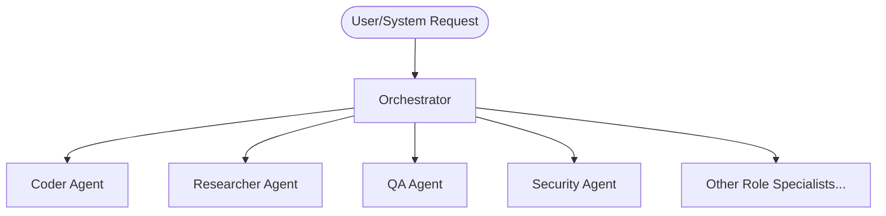

# Agent Profile Architecture & Learning Loop

This document outlines the architecture, delegation model, and learning loop for the engine teams (`claude`, `codex`, and `agy`) inside `agents/teams/`.

## 1. Task Delegation Flow

Each engine contains an **Orchestrator** agent that acts as the entry point for all engine tasks. 



When a task is received:
1. **Assessment & Decomposition**: The **Orchestrator** analyzes the task specifications and decomposes them into discrete sub-tasks.
2. **Role Mapping**: The **Orchestrator** evaluates the `Specialization` and `Strengths` sections of the agent profile files (e.g., [coder.md](./claude/coder.md) or [researcher.md](./claude/researcher.md)) to identify the best-suited role.
3. **Execution**: The task is assigned to the selected agent(s), who perform the work using their designated scratchpad (e.g., [scratchpad/](./claude/scratchpad/)).
4. **Validation**: The **Orchestrator** routes the output to specialized validation roles (such as QA or Security) before completing the loop.

---

## 2. Close of the Learning Loop (Feedback Write-Back)

A key mechanism of our team architecture is the **per-agent learning loop**. When a verification agent (e.g., QA or Security) detects an issue in another agent's work, the lesson must be documented directly in that agent's profile.

### Step-by-Step Learning Process:
1. **Detection**: The **QA** or **Security** agent runs validation tests/audits and encounters an issue (e.g., a bug, styling mismatch, or security vulnerability) in the output produced by the **Coder**, **Designer**, etc.
2. **Analysis**: The validating agent analyzes *why* the failure occurred and defines a concrete lesson or rule to prevent it in the future.
3. **Write-Back**: The validating agent (or the Orchestrator coordinating the run) appends a dated entry to the **Lessons learned** section of the offending agent's profile file (e.g., `coder.md` or `designer.md`).
4. **Integration**: On subsequent tasks, the agent reads its own updated profile (specifically the **Lessons learned** section) during initialization, absorbing past mistakes as active constraints.

### Format for Lessons Learned Entries:
```markdown
### YYYY-MM-DD - [Brief issue tag/context]
- **Issue**: Description of what went wrong and how it was discovered.
- **Remedy**: Specific instruction/actionable rule to follow in the future.
```

---

## 3. Cloning Agents for Capacity Scaling

When an engine requires additional capacity of a specific role (e.g., multiple coders running in parallel), the Orchestrator can instantiate a clone of the agent role.

### How to Clone a Role Specialist:
1. **Copy the Profile Template**: Duplicate the baseline role markdown file (e.g., copy `coder.md` to `coder_2.md` or `coder_refactor.md`).
2. **Update Metadata**: Rename the file and adjust the `Role` header inside the file if needed (e.g., `# Coder 2 Agent Profile - CLAUDE Engine`).
3. **Reference Workspace**: Direct the new sub-agent to use a dedicated sub-folder in the scratchpad (e.g., `scratchpad/coder_2/`) to avoid file collisions.
4. **Register**: Provide the clone's path to the Orchestrator so it is recognized as a valid target for routing.

For more details on team structures and directories, refer to:
- Claude Team: [claude/](./claude/)
- Codex Team: [codex/](./codex/)
- Agy Team: [agy/](./agy/)
