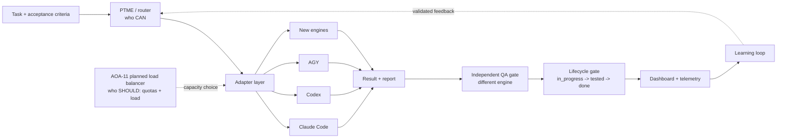

# AOA product manual

> **TLDR**
>
> - Agents are replaceable; AOA's orchestration, evidence, and independent QA gates are the product.
> - AOA sends work through one adapter contract to different CLI engines without exposing prompts in telemetry.
> - Every normal task moves through `in_progress -> tested -> done`, and the worker can never certify its own work.
> - PTME chooses capable model/effort options; the planned AOA-11 load balancer will choose among them using live capacity.
> - Start with two authenticated engine CLIs, run the installer, then use `aoa demo` to see the quality gate catch a planted defect.
>
> **Date:** 2026-07-13<br>
> **Author:** Codex GPT-5.6 Sol<br>
> **Checked by:** AGY Gemini 3.5 Flash (High) — independent QA PASS, 2026-07-13<br>
> **Version:** 1.0<br>
> **Links:** [README](../README.md) · [Architecture](../ARCHITECTURE.md) · [Operators](../OPERATORS.md)

## What AOA is and why it exists

AOA is a local-first orchestration and quality layer for heterogeneous agent CLIs. It gives Claude Code, Codex, AGY, and future engines one dispatch contract, one task lifecycle, shared recovery state, operational telemetry, and an enforced independent-QA gate.

Agents are commodities: model names, prices, quotas, and strengths change. The durable product is the layer that decides who can do a task, dispatches it safely, records evidence, prevents self-certification, and learns from outcomes. Quality comes from the **sum of the parts**. A cheap model can implement a bounded task, a different vendor's model can challenge and test it, and the gated result can be stronger than either model working alone.

AOA invokes already-installed command-line tools. It does not host models, store vendor credentials, or make every engine interchangeable in capability; adapters isolate their verified differences.

## Install

### Prerequisites

- Git and Python 3.8 or newer. Python below 3.11 also needs `tomli`.
- At least two supported CLIs on `PATH`: `claude`, `codex`, or `agy`.
- Each selected CLI authenticated through its own vendor-supported login flow.
- Permission to create a local Python editable install and listen on loopback port `7780` for the dashboard.

### Windows

After cloning the repository, open its folder in File Explorer, right-click `install.ps1`, and choose **Run with PowerShell**. In a terminal, the equivalent is:

```powershell
Set-Location multi-agent-orchestration
.\install.ps1
```

If PowerShell policy blocks the script, use the one-run command below from the repository's parent folder:

```powershell
powershell -ExecutionPolicy Bypass -File .\multi-agent-orchestration\install.ps1
```

A double-clickable `.bat` shim is planned as AOA-15; it is not shipped in version 1.0.

### macOS and Linux

```bash
cd multi-agent-orchestration
chmod +x ./install.sh
./install.sh
```

`sh ./install.sh` is also supported.

### What the config wizard does

The installer discovers registered adapter executables and asks:

```text
Adapters to configure [agy,claude,codex]:
```

Press Enter for every discovered engine or enter a comma-separated subset containing at least two. The wizard writes absolute executable paths, enabled lanes, and different demo worker/tester choices to gitignored `aoa.config.local.json`. It then seeds local task and dashboard state, installs the `aoa` command, probes authentication sequentially, and starts the dashboard at <http://127.0.0.1:7780/>. Credentials remain in vendor CLI stores.

Each auth health-probe is a small live, non-mutating call. It verifies that the executable starts non-interactively, the current session can access a model, and the exact engine marker returns before the configured timeout:

| Engine | Required marker | What failure means |
|---|---|---|
| Claude Code | `AOA_CLAUDE_OK` | The binary, session, model access, or non-interactive invocation is unavailable. |
| Codex | `AOA_CODEX_OK` | The binary, session, model access, or non-interactive invocation is unavailable. |
| AGY | `AOA_AGY_OK` | The binary, session, PTY path, model access, or non-interactive invocation is unavailable. |
| Stub fixture | `AOA_STUB_OK` | The deterministic local adapter contract is broken. |

Sequential probes also avoid simultaneous refreshes of vendor auth caches. A failed install prints `[preflight] <engine> FAIL` and exits loudly; repair the CLI session and rerun.

## Use

### Task lifecycle, end to end

1. **Register the task.** Add a neutral task ID, title, complexity, and `pending` status to `tasks/active_tasks.json`. M/L/XL supervised tasks also need a validated pre-task spec.
2. **Claim and dispatch a worker.** `scripts/coordinator.py` atomically claims the task, then `scripts/dispatch.py` loads the configured adapter, runs its preflight, invokes the worker, and captures a report.
3. **Write the report incrementally.** Record decisions, commands, exit codes, artifacts, and remaining risk while work is happening. Agent output alone is not a durable QA record.
4. **Run independent QA.** A different engine inspects the artifact and acceptance criteria, reruns relevant checks, and writes its own evidence. Failed QA returns work to `in_progress`.
5. **Mark tested.** `coordinator.py mark-tested` records the different tester and its report path. It does not create the report.
6. **Finish.** Only a successfully tested task can move to `done`; direct `in_progress -> done` is rejected.

Typical operator commands are:

```bash
python scripts/task_spec.py validate --task TASK-101
python scripts/coordinator.py claim --task TASK-101 --model codex
python scripts/dispatch.py --engine codex --prompt "Implement TASK-101" --workdir . --task-id TASK-101 --role worker
python scripts/coordinator.py mark-tested --task TASK-101 --tested-by claude --result-path reports/TASK-101-qa.md
python scripts/coordinator.py mark-done --task TASK-101
python scripts/coordinator.py status --task TASK-101
```

### `aoa demo` walkthrough

Run:

```bash
aoa demo
```

If the command is not on `PATH`, use `python -m aoa_cli demo`. The demo claims `HELLO-ORG-001`, dispatches a worker, and plants an implementation that passes visible ASCII tests. A premature `done` transition is blocked. A different tester then runs a hidden-style Unicode oracle and catches the `lower()` versus `casefold()` defect.

Expected key lines are:

```text
visible worker tests: PASS
lifecycle gate: BLOCKED false done (tester sign-off missing)
independent tester: CAUGHT planted Unicode casefold defect
task state: in_progress (never advanced to tested/done)
```

The command exits 0 because orchestration worked, not because the planted implementation passed QA. The dashboard records the catch with QA `FAIL`; demo state is under `.aoa/demo/hello-org`.

### Read the dashboard

Open <http://127.0.0.1:7780/> after installation. Runtime feeds live under `.aoa/dashboard`.

- **Top cards** summarize team size, active agents, completed work, learning-loop activity, and available usage data.
- **Engine usage** shows reported capacity. Codex has separate 5-hour and weekly windows. A dash means “not reported,” never zero.
- **Agent activity** separates live work from idle seed slots; stale-running rows are operational warnings.
- **Live Tasks** is the dispatch ledger: engine, model, effort, status, duration, and QA result.
- **Analytics and learning** are indicative v0 views. Treat attribution, reconciliation, and lag as preview-quality signals, then inspect the underlying report before making a release decision.

Refresh after producer updates. If the server is stopped, run `python scripts/dashboard_server.py --directory .aoa/dashboard`.

### Add an engine

The full cold path is in [Add your own agent](ADD_YOUR_OWN_AGENT.md):

1. Verify the exact CLI/version contract on every target OS: non-interactive stdin, model/effort flags, tool controls, auth, output, exit codes, cancellation, quotas, concurrency, and child processes.
2. Add `scripts/adapters/<engine>.py` with `engine`, `build`, `parse`, and `probe_prompt` using the shared `DispatchRequest` and `Invocation` types. Prompts belong in stdin, never argv, environment, display output, or telemetry.
3. Register the adapter disabled in `aoa.config.json`. For parallel/PTME use, also add an engine limit, a capability row, and complete S/M/L/XL ladders.
4. Review `--list-adapters` and a redacted `--dry-run`, enable the adapter, then validate live success and every failure path. Disable and reroute explicitly if the contract fails; never silently substitute an engine.

`scripts/adapters/example_echo.py` is the working teaching implementation.

## Component by component

### Adapter contract and the four adapters

| Component | What it does | Why it matters | How it works | File |
|---|---|---|---|---|
| Base contract | Defines a provider-neutral request, invocation, and adapter protocol. | Vendor churn stays outside the core dispatcher. | An adapter builds argv/stdin, parses the final report, and declares a cheap probe marker. | `scripts/adapters/base.py` |
| Claude adapter | Runs Claude Code headlessly and reads its JSON result. | Claude can work or test behind the same lifecycle. | Sends the prompt on stdin, disables unrequested MCP, maps model/effort, parses `result`. | `scripts/adapters/claude.py` |
| Codex adapter | Runs `codex exec` and captures the final agent message. | Codex becomes a truthful interchangeable lane. | Streams the prompt to `-`, parses JSONL, and returns the last completed `agent_message`. | `scripts/adapters/codex.py` |
| AGY adapter | Runs AGY through a portable PTY/ConPTY bridge. | Interactive terminal behavior no longer leaks into dispatch callers. | Sets `TERM=xterm`, delegates terminal handling to `agy_pty.py`, and parses stdout. | `scripts/adapters/agy.py`, `scripts/agy_pty.py` |
| Stub adapter | Proves a fourth registration without a vendor account. | Contract and installer tests stay deterministic. | Uses local Python, consumes stdin, and returns a fixed health marker. | `scripts/adapters/stub.py` |

The additional `scripts/adapters/example_echo.py` is the AOA-10 tutorial adapter used by the add-an-engine guide; it is disabled by default.

### Dispatch

**What:** one config-driven execution path. **Why:** every engine gets the same redaction, timeout, cleanup, telemetry, and failure semantics. **How:** it resolves the executable, loads the registered adapter without an engine switch, probes auth, sends stdin in the requested working directory, kills timed-out process trees, parses a final report, and emits prompt-free JSONL. Exit 2 is missing/preflight failure, 3 empty report, 124 timeout, and 130 cancellation. **File:** `scripts/dispatch.py`.

### Coordinator and lifecycle gate

**What:** atomic task ownership and guarded state transitions. **Why:** execution cannot be mistaken for proof. **How:** filesystem locks protect claims and updates; `mark-tested` rejects a worker matching the tester; `mark-done` requires prior tested state and evidence. Recovery-only `--force` bypasses safeguards and should not be used normally. **Files:** `scripts/coordinator.py`, `scripts/session_end_gate.py`.

### PTME routing

**What:** task complexity, capability, model, and effort selection. **Why:** small work should not consume the most expensive lane, and a foreign model must not slip into an incompatible engine. **How:** PTME classifies S/M/L/XL, applies engine-scoped ladders and promoted rules, and logs decisions; routers apply queue keywords, role/capability signals, and rate-wall exclusions. **Files:** `scripts/ptme.py`, `scripts/task_router.py`, `scripts/router.py`, `scripts/routing_table.py`.

### Telemetry and dashboard feeds

**What:** prompt-free operational visibility. **Why:** operators need to see who ran, duration, failures, QA, capacity, and learning without leaking task content. **How:** dispatch lifecycle events feed activity and live-task bridges; refresh/analytics jobs reconcile JSON/JS feeds consumed by the local dashboard. **Files:** `scripts/agent_telemetry.py`, `scripts/agent_activity.py`, `scripts/dispatch_worker.py`, `scripts/orchestrator_stats.py`, `scripts/build_analytics.py`, `scripts/telemetry_refresh.py`, `dashboard/index.html`.

### Checkpoint and worktree manager

**What:** resumable task state and isolated parallel workspaces. **Why:** rate walls or crashes should not erase progress, and concurrent workers must not corrupt one Git index. **How:** checkpoints store completed/remaining/next-step context plus a resume queue; the manager creates a temporary branch and sibling worktree per task, then removes it after completion. **Files:** `scripts/checkpoint.py`, `scripts/worktree_manager.py`.

### Deploy and drift gates

**What:** release preconditions and documentation/runtime consistency checks. **Why:** a green worker report is insufficient if secrets, environment requirements, tests, or examples drift. **How:** the deploy gate runs secret scanning, required-environment validation, tests, and deployment logging; quickstart tests verify documented commands and sample shapes. **Files:** `scripts/deploy_gate.py`, `tests/test_docs_quickstart.py`.

### Learning loop

**What:** converts QA outcomes into measured routing lessons. **Why:** repeated evidence should improve decisions without turning one anecdote into permanent policy. **How:** it records outcomes, reflects candidate rules, validates later benefit, promotes supported rules, demotes regressions, and feeds PTME/dashboard summaries. **File:** `scripts/learning_loop.py`.

## Important rules: the standards funnel

1. **Worker != tester, always.** Rotate worker/QA engine pairings so one vendor's blind spots do not become policy.
2. **No secrets in the repository.** Keep credentials in vendor stores or a secret manager; keep prompts and raw secret-bearing output out of telemetry and reports.
3. **Write reports incrementally.** A current report is recovery state, not end-of-task decoration.
4. **Fail loudly.** Missing executable, failed probe, empty output, timeout, invalid config, and failed QA are failures—not silent success or implicit fallback.
5. **QA before done.** Evidence from a different tester is required before `tested`, and `tested` is required before `done`.

## Cycles and architecture

The product cycle is **dispatch -> independent QA -> learn -> route the next task better**. PTME answers **who CAN do this task** from capability and engine/model compatibility. The planned AOA-11 load balancer will answer **who SHOULD do it now** using live quotas, reset windows, concurrency, queue depth, and recent health. Until that gate ships, operators should treat live-load routing as advisory and keep explicit capacity checks.



A screenshot-ready standalone rendering is available at [architecture.html](architecture.html).

## Known issues and troubleshooting

### Engine rate walls and preflight refusal

Run `python scripts/rate_wall_watchdog.py check` and `python scripts/rate_wall_watchdog.py should-dispatch --engine codex`. At the blocking threshold the latter prints `codex: WALLED - do NOT dispatch`, reports the reset window, and exits nonzero. A live health marker may also fail, producing a generic preflight refusal/exit 2. In-flight work is killed, not paused; save checkpoints and redispatch after reset.

The watchdog reads local session telemetry, so its newest percentage can remain stale after reset until a fresh CLI event is written. Check the displayed source/reset time, make one cheap vendor CLI call to refresh telemetry, then rerun `check`. Never bypass a genuinely failing live probe.

### AGY terminal sandbox regression

Symptom: shell-using jobs report `ShellExecute failed: The operation was canceled by the user`, then `timeout waiting for response`, while text-only work may succeed. Inspect the vendor CLI log and settings for terminal sandbox routing. On affected Windows setups, the proven workaround is to disable terminal sandbox execution and change tool permission from `proceed-in-sandbox` to `always-proceed`, but only if local security policy allows it. Otherwise repair the sandbox/UAC launcher. Retest twice with a harmless shell command.

### Silent model-name fallback

A successful CLI exit does not prove the vendor honored an unknown or deprecated model slug. Use a canonical model ID listed by the installed CLI, inspect the dry-run argv, make a minimal live call that reports the actual model when supported, and compare `logs/ptme_decisions.jsonl`. Remove invalid config or fail explicitly; never accept a silent vendor fallback as the requested model.

### Runtime dashboard state dirties tracked files

Some legacy producers still default to tracked `dashboard/*.json` or `dashboard/*.js`, while the installer serves runtime state from `.aoa/dashboard`. This cleanup is tracked as INO-27. Until it lands, target `.aoa/dashboard`, check `git status` after runtime commands, and never commit generated activity/history into the empty shipped feeds.

### Fast symptom table

| Symptom | Action |
|---|---|
| Installer finds fewer than two adapters | Put two supported, authenticated CLIs on `PATH`, then rerun. |
| Dispatch exits 2 | Repair executable/auth/model access; rerun the adapter probe. |
| Dispatch exits 3 | Treat empty parsed output as a backend/parser failure. |
| Dispatch exits 124 | Inspect partial work, save a checkpoint, then retry after capacity returns or raise the verified timeout. |
| `mark-done` is rejected | Run different-engine QA, save its report, call `mark-tested`, then retry. |
| Dashboard is unavailable | Start `python scripts/dashboard_server.py --directory .aoa/dashboard` and confirm port 7780 is free. |
